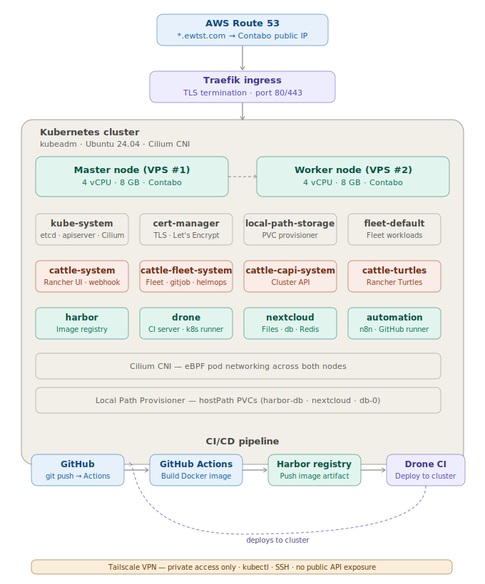
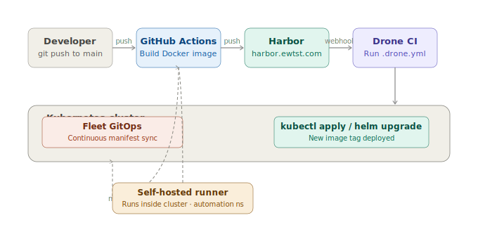
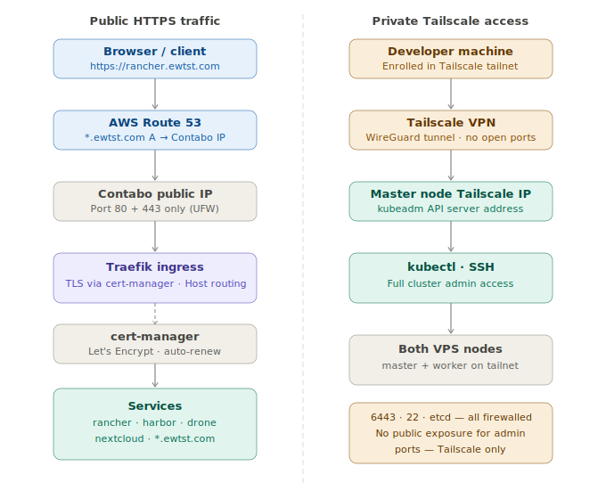

# 11 — Architecture Diagrams

Visual reference for the full infrastructure. All diagrams are SVG files stored in [`diagrams/`](./diagrams/) and render natively in GitHub.

---

## Cluster overview

Full picture of both VPS nodes, all namespaces, the CI/CD pipeline, and Tailscale access in one view.

---

## CI/CD pipeline

End-to-end flow from `git push` through GitHub Actions, Harbor, and Drone CI into the cluster, including the Fleet GitOps sync path and the self-hosted runner loop.

---

## Networking — public and private access

Left side: how public HTTPS traffic flows through Route 53 → Contabo public IP → Traefik → cert-manager → services.
Right side: how private `kubectl` and SSH access works via the Tailscale VPN tunnel.

---

## Colour legend

| Colour | Meaning |
|--------|---------|
| 🟦 Blue | External / internet layer (Route 53, GitHub, browser) |
| 🟩 Teal/Green | Cluster workloads and nodes (Harbor, Nextcloud, Drone, VPS nodes) |
| 🟧 Coral/Orange | Rancher stack (cattle-system, Fleet, CAPI, Turtles) |
| 🟪 Purple | Ingress and CI trigger (Traefik, Drone CI) |
| ⬜ Gray | System / structural (kube-system, storage, worker bands) |
| 🟨 Amber | Private access layer (Tailscale, self-hosted runner) |
